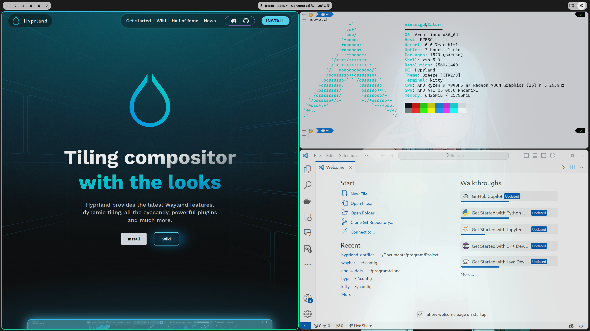

# Hyprland DotFiles

Personal configuration files, intended for my own use and as a reference for others, without any guarantee of reliability, including usability and readability 😬. 

Just started getting acquainted with Hyprland, so when writing these configuration files, maintainability was not considered. I referred to many other dotfiles repositories, so there is some dead content, please excuse this.

Recommended by @shirok1 to open source this.

## Screenshot

## Acknowledgments

These configuration files are **largely** based on the content of these projects/repositories:

- GNOME As a heavy GNOME user, I really like some of GNOME's interaction logic (which doesn't stop me from thinking some of its companion software is really hard to use), much of which is inspired by GNOME.
- [end-4/dots-hyprland](https://github.com/end-4/dots-hyprland)
- [DN-debug/waybar-example](https://github.com/DN-debug/waybar-examples)

## Interaction Logic

- `super` to open and close wofi (application launcher)
- `super + ENTER` to open the terminal (kitty)
- `super + w` to close the window
- `super + J/K` to switch between left and right workspaces
- `super + mouse_scroll` to switch between left and right workspaces
